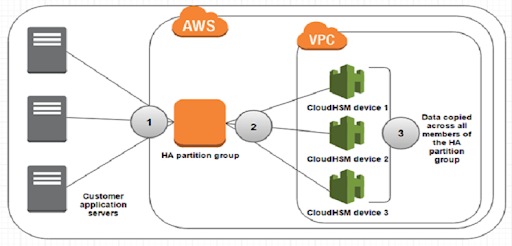

# CloudHSM - Hardware Security Module

* Hardware based
* FIPS 140-2 Level 3
* Single tennet
* Dedicated hardware
* Multi-AZ cluster
* Runs within the context of a VPC
* Industry standard APIs
* 

### aws-hsm