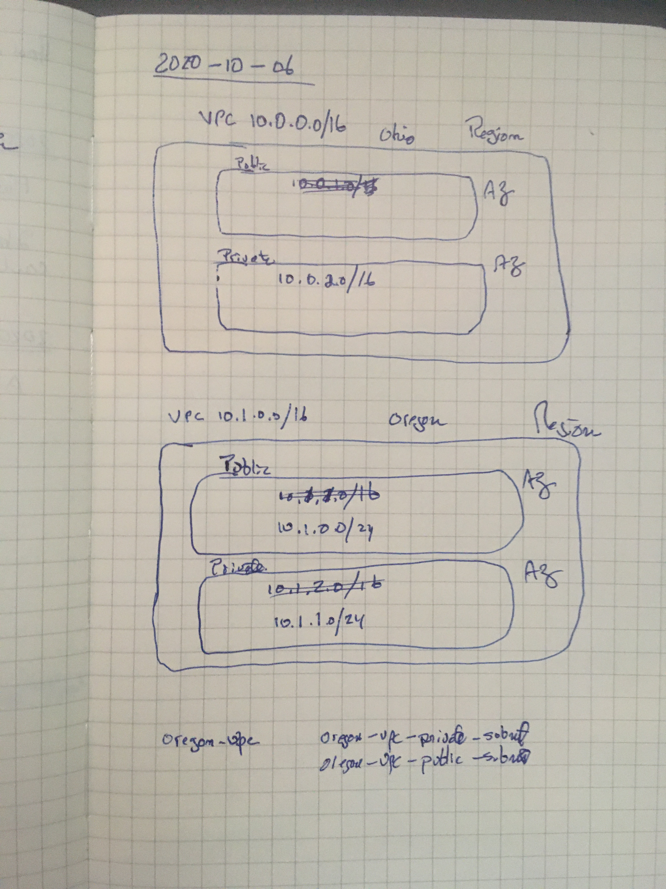

# aws-organization
# Organization

AWS Organizations is an account management service that enables you to consolidate multiple AWS accounts into an organization that you create and centrally manage. AWS Organizations includes account management and consolidated billing capabilities that enable you to better meet the budgetary, security, and compliance needs of your business. As an administrator of an organization, you can create accounts in your organization and invite existing accounts to join the organization.

[[aws-account]]

I watched a very brief introduction to AWS Organization concept. I'm not sure how it relates to GCP IAM structures... Need to sort this out.

## Exam Tips

* Always enable MFA on root account - which is the "paying account".
* "really good" password on root account
* A "paying account" is used to aggregate costs to get discounts. Do not deploy any resources to this account.
* Enable / Disable AWS using Service Control Policies (SCP) with on OU or individual accounts.
