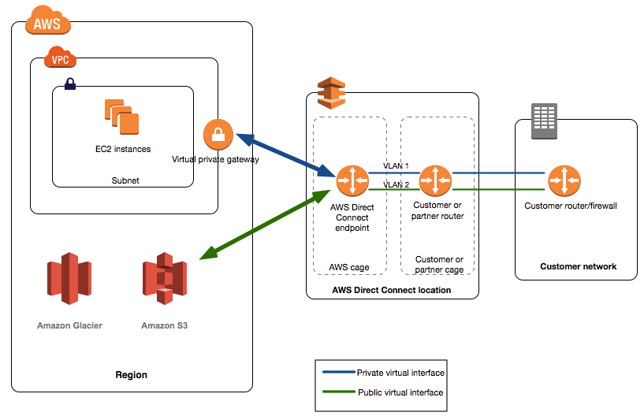

# Direct Connect

A Direct Connect is a *dedicated* network connection between AWS and a location external to AWS.
Because it is a dedicated network circuit and not a connection over the public network, it is inherently **more secure**.

In the middle of the diagram, within the AWS Direct Connect location (a physical location) there are two cages of equipment. Once with an AWS router and the other with the customer
router.
A direct network connection is made between the AWS router and the customer router.

Across the direct network connect two VLAN circuits are configured. One for access to the private IP address range and the other to all public IP addresses at AWS.

The advantages of a Direct Connect are:
* Reduce network costs 
* Increase consistency
* Increase bandwidth

## Virtual Interface

AWS Direct Connect offers:
* Public Virtual Interface
* Private Virtual Interface
* Transit Virtual Interface

### Public Virtual Interface

Used to connect to AWS services that are exposed through a public IP address, such as S3.
* Connect to all AWS public interfaces globally
* Access publically routable service in any region except AWS China)

### Private Virtual Interface

Used to connect to AWS VPC based resources.
* Connect to VPC resource (EC2, load balancers) on private IP addresses or endpoing
* Connect Private Virtual Interface to a DX Gateway which is then associated with Virtual Private Gateway(s) in any other AWS Region.
* Connect to multiple VPCs in any AWS Region (because a virtual private gateway is associated with a single VPC)

Private IP CIDR is advertised over [[network-protocol-bgp]].

### Transit Virtual Interface

Used to connect to resource through a transit gateway.
* Connect multiple PVCs in the sam eof different AWS accounts using DX.
* Associate up to three tansit gateways in the same AWS Region when you use a transit virtual interface to connect to a DX gateway.
* Attach VPCs in the same AWD Region to the transit gateway.

## Sets to set up a Direct Connection
* Create a Public Virtual Interface (for ...)
* Create a Customer Gateway in the VPN configuration section of VPC
* Create a Virtual Private Gateway
* Attach the Virtual Private Gateway to the desired VPC
* Creata a new VPN connection
* Select:
  * Virtual Private Gateway
  * Customer Gateway
* Set up the VPN circuit on the customer hardware side of the connection.

### aws-vpc-connection-directconnect

[[z:zettels?tag=amazon/aws/vpc/connection/*]]