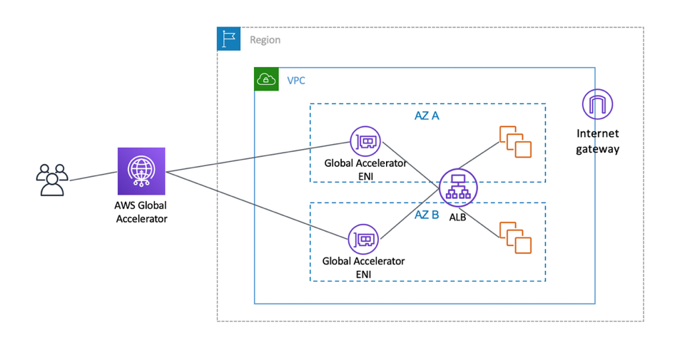

# aws-vpc-global-accelerator
# Global Accelerator

A Global Accelerator provides a mechanism to avoid sending network traffic from a user to resources in AWS across a portion of the public internet.

Amazon has AWS *edge locations* in many parts of the world. One side of an edge location connects to the public internet and the other to the Amazon backbone network. Instead of having traffic route through many ISPs on the way to Amazon, as illustrated:

  

The Global Accelerator provides a more direct path, as illustrated:

  

offers a connection into the Amazon
backbone network located as close as possible to end users. 

The user-facing point is an Amazon Edge Location. The Amazon facing location is a *network zone* (not an availability zone). 

  

