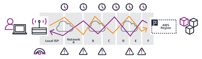
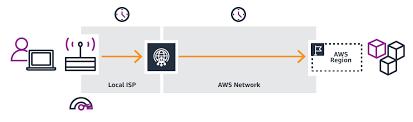

# aws-vpc-global-accelerator
# Global Accelerator

A Global Accelerator offers a connection into the Amazon
backbone network located as close as possible to end users. 

The user-facing point is an Amazon Edge Location. The Amazon facing location is a *network zone* (not an availability zone). 

