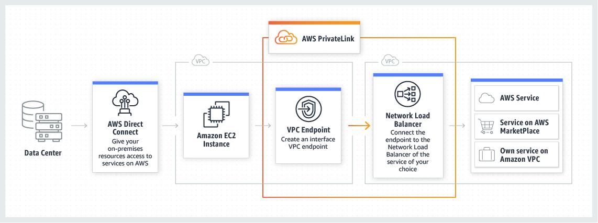

# Private Link

PrivateLink provides a private connection between VPCs
and:
* AWS services
* AWS Marketplace applications
* ?Your own VPCs?
* On-premise services

by providing a private [Interface Endpoint](aws-vpc-endpoint).

Eliminates the need for an [Internet Gateway](aws-vpc-internet-gateway), [NAT device](aws-vpc-gateway-nat), or a public IP address.

Also works with [Direct Connect](aws-vpc-direct-connect) to support a private connection to services on-premise.

## Client side

An *Interface Endpoint* is created in a specific VPC. The interface endpoint ??has the name of the remote 'service' associated with it??

Within a subnet an *endpoint network interface* presents a private IP address that allows network traffic to flow to the remote service.

Security groups may be associated with the endpoint network
interface.

In some situations (AWS services and AWS Marketplace Partner services) a private DNS for the endpoint can be enabled.

## Provider Side

Requires:
* Network Load Balancer on the service side
* Elastic Network Interface on the client side

 # Exam Tips
 
 Connect VPC to tens, hundreds, or thousands of customer VPC then think about Private Link.

### aws-vpc-private-link