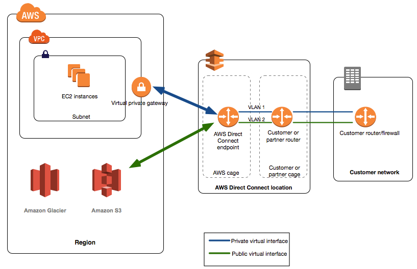

# Private Link

PrivateLink provides a private connection between VPCs
and:
* AWS services
* AWS Marketplace applications
* ?Your own VPCs?
* On-premise services

by providing a private [endpoint](aws-vpc-endpoint).

Eliminates the need for an [Internet Gateway](aws-vpc-internet-gateway), [NAT device](aws-vpc-gateway-nat), or a public IP address.

Also works with [Direct Connect](aws-vpc-direct-connect) to support a private connection to services on-premise.

Supports the linkage of many *client* VPCs to a service VPC.
The alternatives are:
* Open the service to the internet
* Create N:1 VPC peering relationships.

Requires:
* Network Load Balancer on the service side
* Elastic Network Interface on the client side

 # Exam Tips
 
 Connect VPC to tens, hundreds, or thousands of customer VPC then think about Private Link.

### aws-vpc-private-link